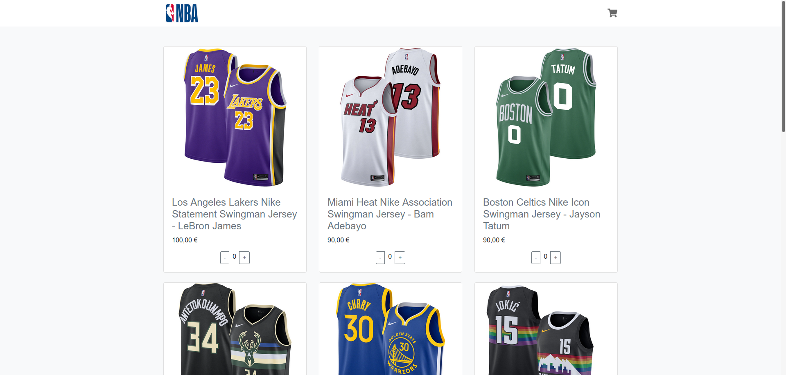

# Shopping-Website

A simple shopping website template **built with Vue.js and Django REST Framework**.

You can add, update and delete persistent items (each with a name, price, quantity and picture) via the Django admin website.

Front-end and back-end communicate thanks to **Axios that is consuming the REST API**.

I might implement the shopping cart and other features later.

## Stack

**front-end :**
- HTML
- CSS (Bootstrap, Font Awesome)
- JavaScript (Vue.js)
- Axios

**back-end :**
- Django (Django REST Framework)

## Requirements

- Python3+ (https://www.python.org/downloads/)
- Node.js (https://nodejs.org/en/)

## How to use

- Activate virtual environment : `source env/bin/activate`
- Install required Python packages : `pip install -r requirements.txt`
- Start the back-end server : `python manage.py runserver`
- Access Django admin website at this url : http://127.0.0.1:8000/admin
- Connect as an admin with : `username : admin - password : admin`
- Install required Node.js modules : `cd vueapp/vuedjangorest/` and `npm install`
- Start the front-end server : `npm run serve`
- Visit the website at this url : http://localhost:8080/
- You can now add, update and delete items from the Django admin website and see the results in real time on the web page.

## Screenshots

